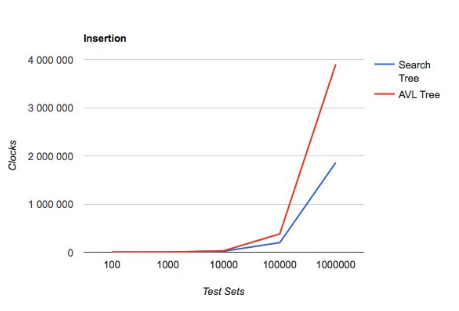
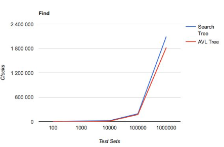
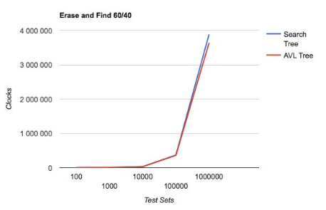
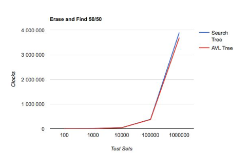
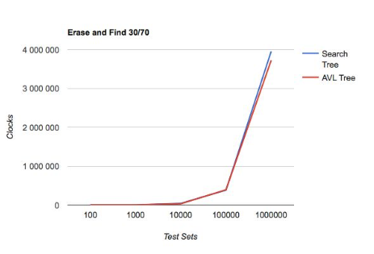

# BinarySearchTrees
Performance Comparison Tests for AVL Tree and Binary Search Tree

AVL Tree and Binary Search Tree were studied. The whole idea and algorithms were taken from “ Data Structures and Algorithms in C++ “.
Implementation idea was straightforward taken from book materials. All methods except restructure(x) got really easy in dealing with, while restructure(x) took more time since it was difficult for me to keep track of all pointers in all rotations and I usually got some segmentation fault errors and warnings.

In Performance and comparison part I created tests for 100, 1000, 10000, 100000 and 1000000 elements for each set size (100, 1000, 10000, 100000 and 1000000 elements) I fill 3 files with 3 different random sets.

For generation of random numbers I use seed and do srand() in 3 different ways to generate random different sets for testing insertion, find and erase and find.
Each time I run main.cpp I got different outputs in file “PerformanceComparison.txt” because I made srand dependent on current time.
In testing each insertion, find and erase and find I use clock(), only during operation I test.

I take test set for insertion from RandomSet.txt and for find from RandomSetFind.txt, files with different random datasets generated using srand().

For erase and find I generate random choice between insert and find in these ratios: 30/70, 50/50, 60/40. I do this using srand and mode of division by 10.So if choice is 0, 1 or 2, I do erase since these 3 elements are 30% of all possible and do find otherwise.

Let’s take a look at visualization for better analysis:

In my tests for small datasets AVL Tree and Search Tree a pretty similar, however as it could be expected Insertion to AVL tree takes much more time for large datasets. It is natural consequence because often insertion to AVL Tree require additional operations for tree rotations for keeping tree balanced.

However, find in AVL Tree in most cases better than in Search Tree. This is where balanced structure of a tree shows its use. 

In my opinion, AVL Tree is perfect data structure for data you need to insert once and use a lot without modification.
Going further:

In all above conditions AVL Tree has shown better performance for erase and find.Overall improvement in find overweights all drawbacks.

In conclusion, I want to say that for small data sets both trees are pretty similar. However, for large data set, especially, if amount of find operations overweights modification operations, AVL Tree is much better than Search Tree.
